# Microsoft XDR Security Operations Lab

## Overview

This lab demonstrates the implementation and configuration of Microsoft Defender XDR security policies within a Microsoft security environment. The project focused on configuring protection policies for Exchange Online and Microsoft Defender for Office 365 while exploring Microsoft’s integrated XDR and SIEM capabilities.

The lab strengthened practical skills in:
- Microsoft Defender XDR
- Microsoft Defender for Office 365
- Exchange Online Protection
- Security Policy Configuration
- Extended Detection & Response (XDR)
- Security Operations Center (SOC) workflows

---

# Technologies Used

- Microsoft Defender XDR
- Microsoft Defender for Office 365
- Exchange Online
- Microsoft Sentinel
- Microsoft Defender for Endpoint
- Microsoft Defender for Identity
- Microsoft Defender for Cloud

---

# Objectives

- Configure Microsoft Defender XDR security policies
- Implement protection policies for Exchange Online
- Configure Microsoft Defender for Office 365 protections
- Apply security policies to domains and groups
- Explore integrated XDR and SIEM capabilities
- Understand centralized Microsoft security operations

---

# Lab Activities

## 1. Exchange Online & Defender Policy Configuration

Configured protection policies by navigating to:
- Email & Collaboration
- Policies & Rules

Implemented security configurations for:
- Anti-phishing policies
- Safe Attachments
- Safe Links

### Screenshots

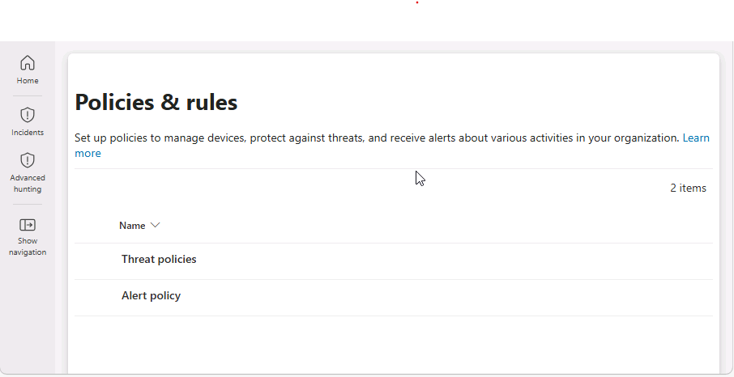

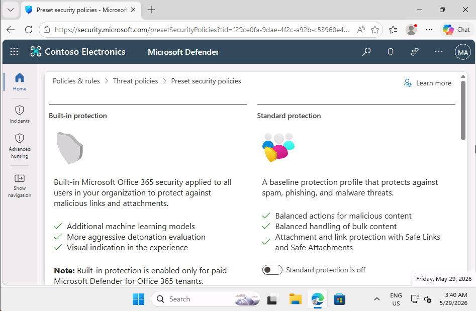

---

## 2. Domain Protection Policy Deployment

Applied security protection policies to the assigned domain environment.

The configuration included:
- Exchange Online protection policies
- Microsoft Defender for Office 365 protection policies

### Screenshots

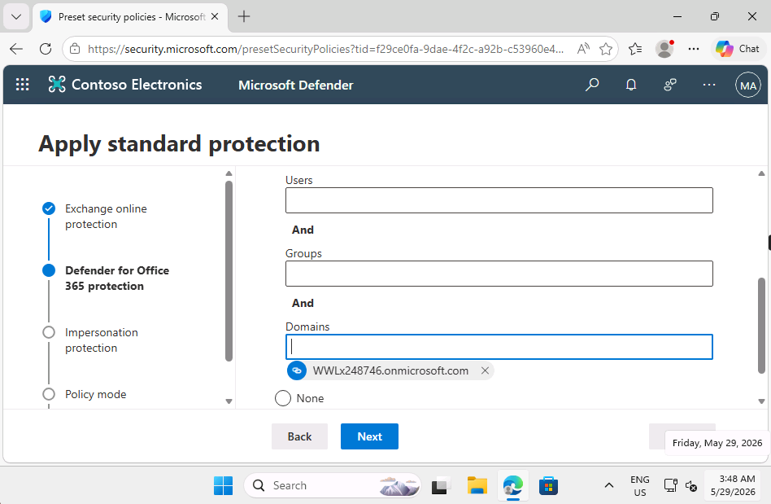

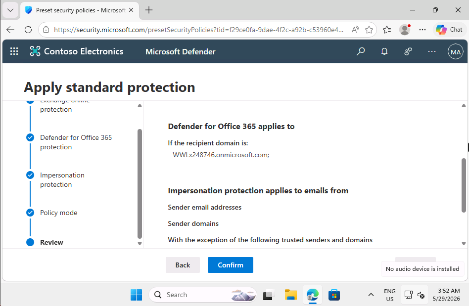

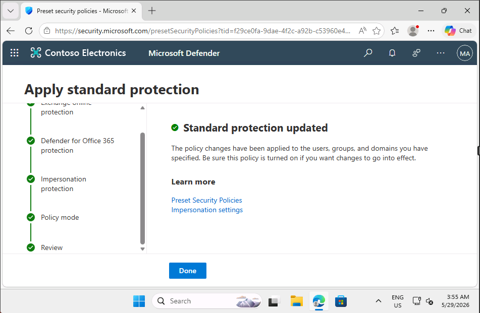

---

## 3. Group-Based Security Policy Configuration

Configured security policies for organizational groups.

### Configured Group
- Leadership

Applied:
- Exchange Online Protection
- Microsoft Defender for Office 365 Protection

### Screenshots

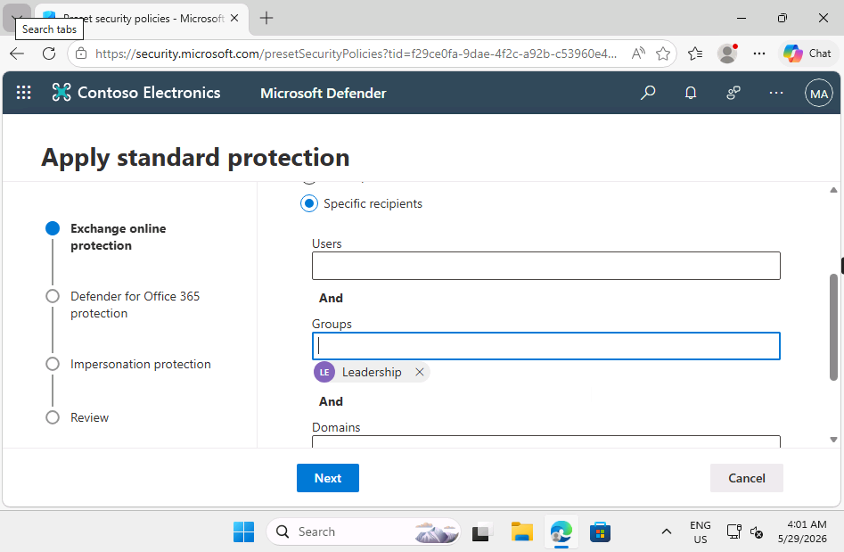

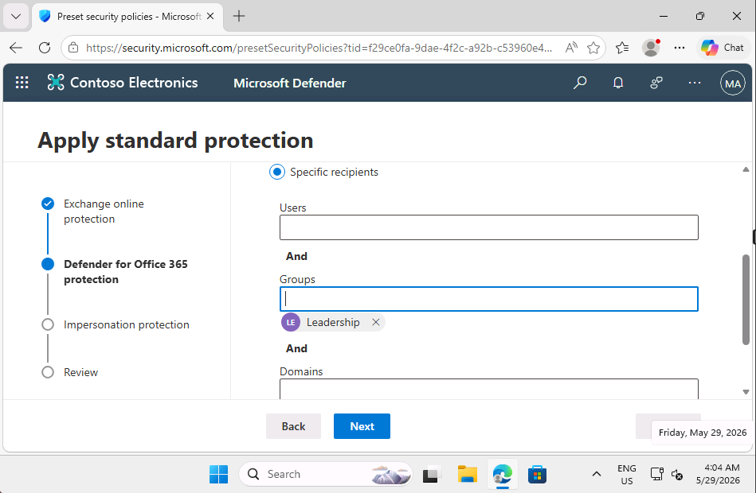

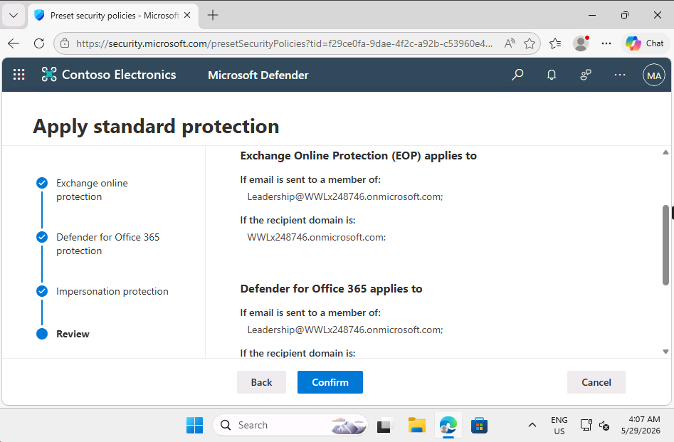

---

# Microsoft Defender XDR Workspace Preparation

Prepared the Microsoft Defender XDR workspace by navigating to:
- Assets
- Devices

This process initialized the integrated Microsoft security environment.

### Screenshots

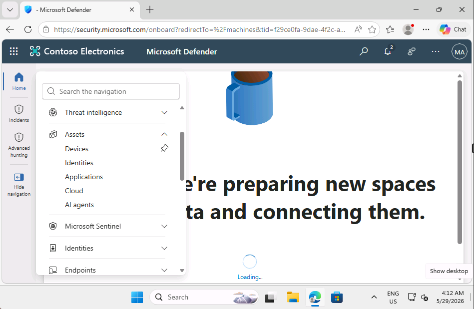

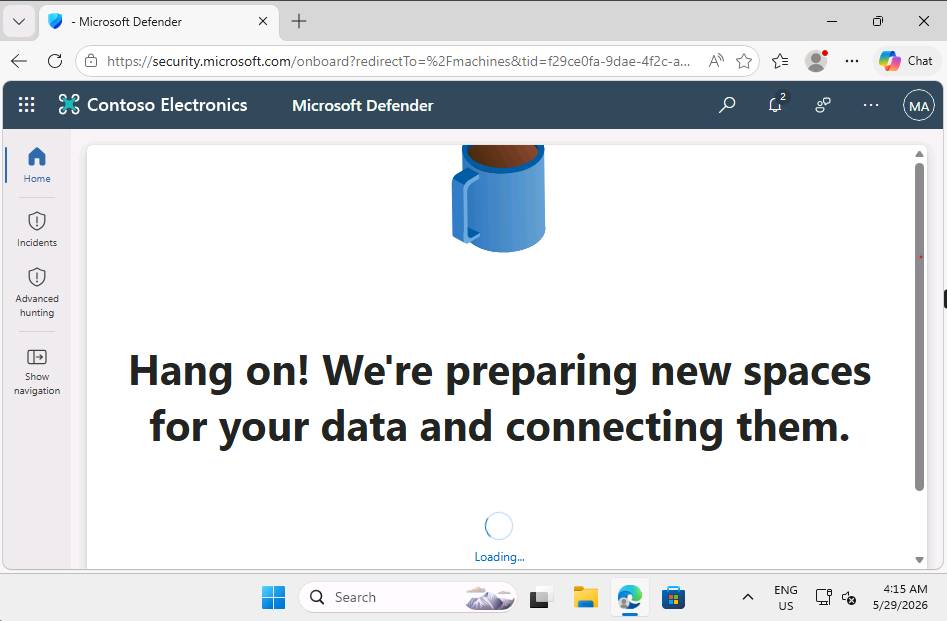

---

# Microsoft Defender XDR Integration

Explored the integration between:
- Microsoft Defender for Endpoint
- Microsoft Defender for Identity
- Microsoft Defender for Office 365
- Microsoft Defender for Cloud

The integrated XDR platform provides:
- Cross-domain threat visibility
- Centralized incident management
- Automated investigation & remediation
- Threat analytics
- Threat hunting capabilities

### Screenshot

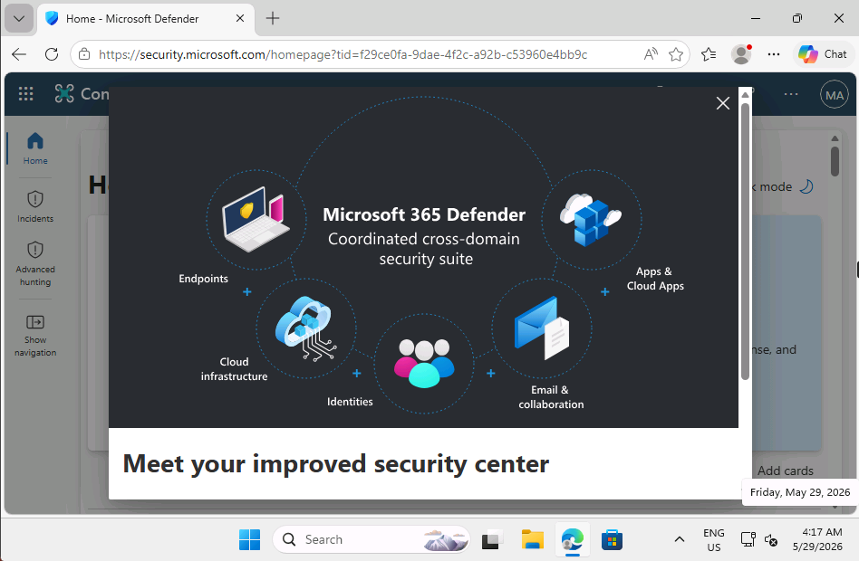

---

# SIEM & XDR Overview

Reviewed the relationship between:
- SIEM (Security Information and Event Management)
- XDR (Extended Detection & Response)

This demonstrated how Microsoft security solutions centralize monitoring, detection, investigation, and response across enterprise environments.

### Screenshot

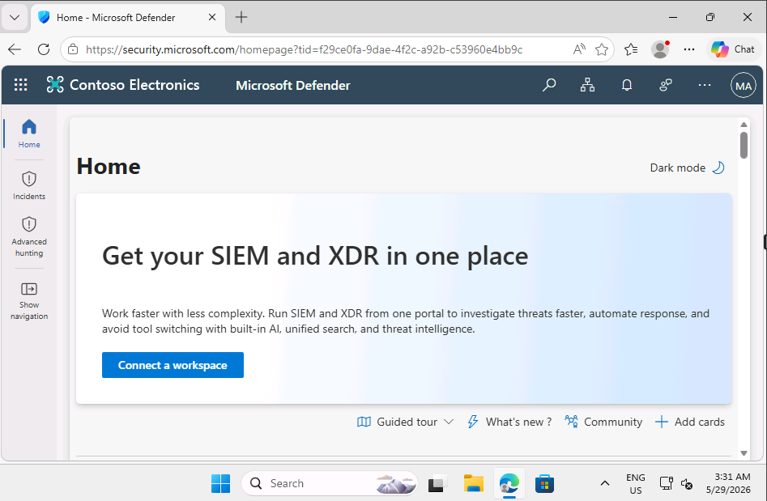

---

# Skills Demonstrated

- Microsoft Defender XDR Administration
- Exchange Online Security
- Security Policy Configuration
- Microsoft Defender for Office 365
- Threat Detection Concepts
- SOC Operations
- SIEM & XDR Fundamentals
- Security Monitoring
- Enterprise Security Management

---

# Lessons Learned

This lab strengthened my understanding of:
- Microsoft security ecosystems
- Centralized security operations
- XDR capabilities
- Security policy management
- Cloud security monitoring
- Threat detection workflows
- Enterprise security administration

---

# Future Improvements

Planned future enhancements include:
- Threat Hunting with KQL
- Microsoft Sentinel Incident Investigation
- Automated Response Workflows
- Advanced Alert Triage
- Endpoint Detection & Response (EDR)
- Security Incident Simulation
