# Microsoft Defender for Endpoint Incident Investigation Lab

## Overview

This lab demonstrates the use of Microsoft Defender for Endpoint to investigate, analyze, and manage security incidents. The project focused on device onboarding, alert investigation, incident analysis, attack simulation, and incident management within a Security Operations Center (SOC) environment.

The lab strengthened practical skills in threat detection, incident response, endpoint security monitoring, and security investigations.

---

# Technologies Used

- Microsoft Defender for Endpoint
- Microsoft Defender XDR
- Microsoft Security Portal
- PowerShell
- Endpoint Detection & Response (EDR)
- Security Operations Center (SOC)

---

# Objectives

- Verify device onboarding in Microsoft Defender
- Investigate security alerts
- Analyze suspicious PowerShell activity
- Review incident timelines and graphs
- Perform incident management activities
- Simulate and investigate a cyberattack
- Review incident indicators and related IP addresses

---

# Lab Activities

## 1. Device Onboarding Verification

Verified that endpoint devices were successfully onboarded to Microsoft Defender for Endpoint.

### Activities Performed

- Accessed Microsoft Defender Portal
- Navigated to **Assets → Devices**
- Confirmed successful onboarding of endpoint device **base23b**

### Screenshots

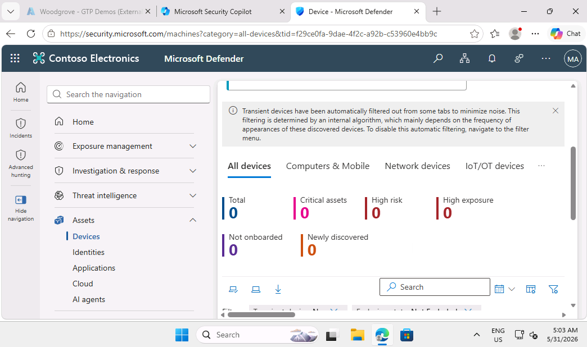

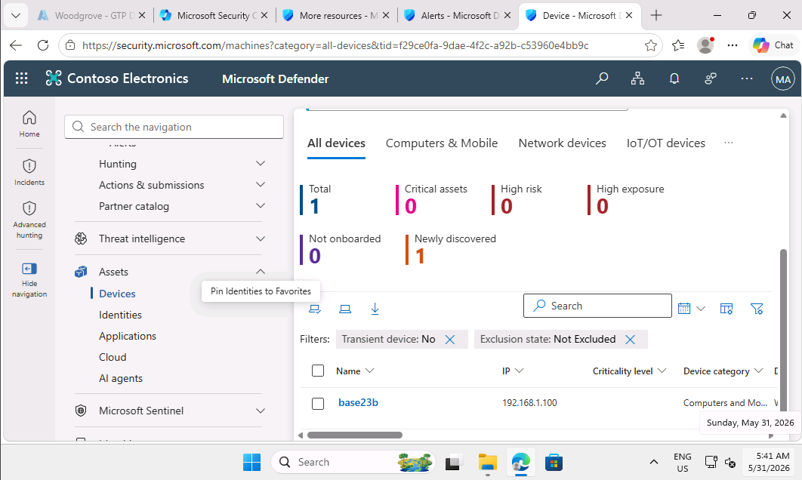

---

## 2. Alert Investigation

Reviewed security alerts generated within Microsoft Defender to identify suspicious activity.

### Activities Performed

- Navigated to **Investigation & Response → Alerts**
- Opened and reviewed the **TestAlert**
- Identified suspicious PowerShell command-line activity

### Screenshots

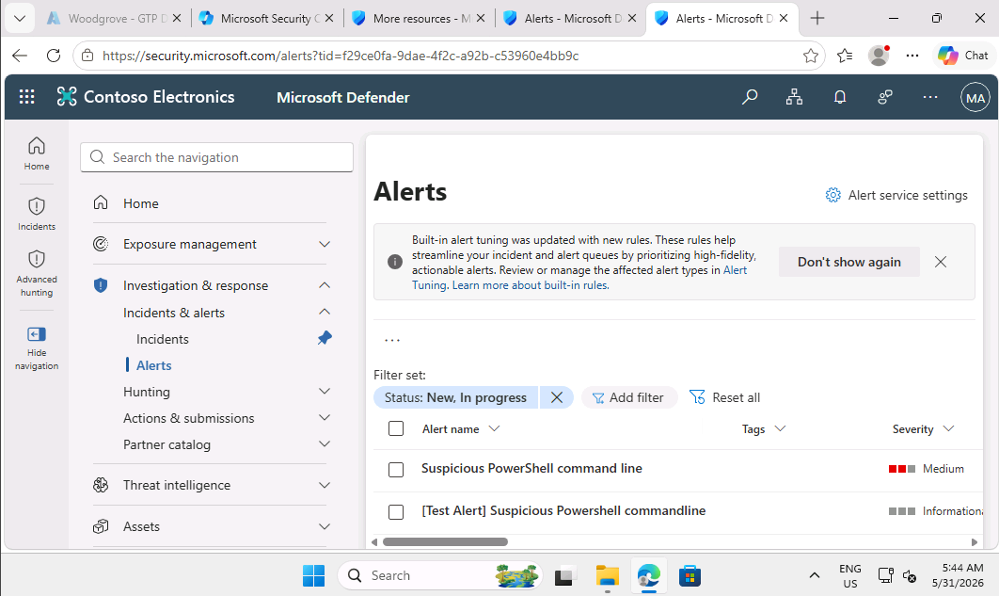

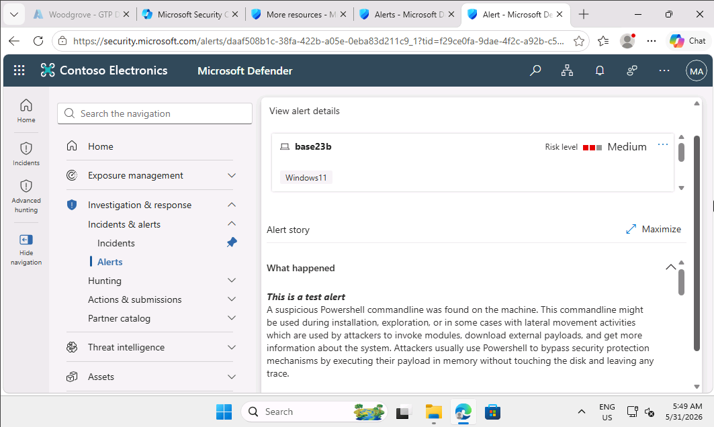

---

## 3. Root Cause Analysis

Investigated the alert story and process tree to determine the source of the detected activity.

### Activities Performed

- Expanded the alert story
- Reviewed the full process tree
- Confirmed PowerShell execution of a suspicious script

### Screenshots

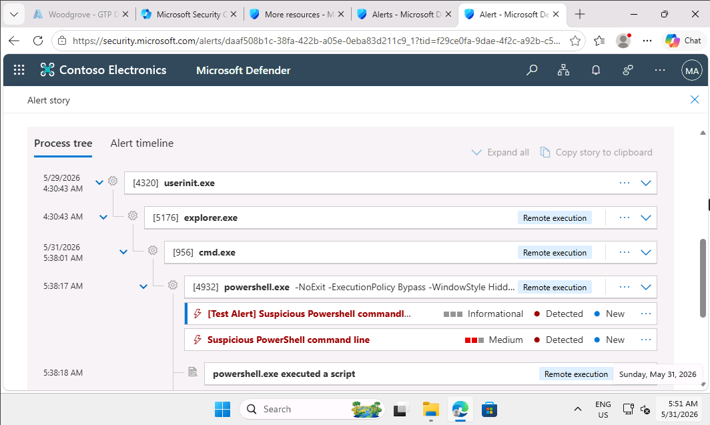

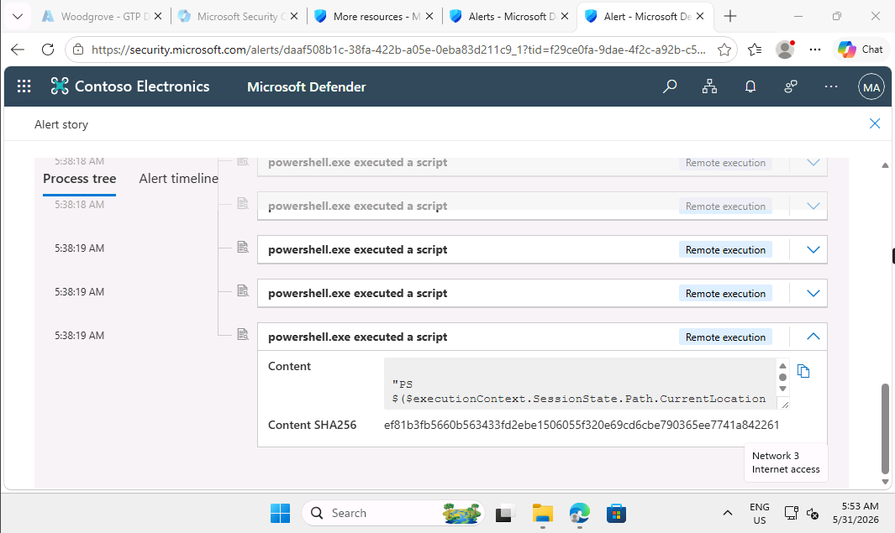

---

## 4. Incident Investigation

Reviewed the associated security incident and analyzed incident details.

### Activities Performed

- Opened the generated incident
- Reviewed incident details and timeline
- Examined recent activity and investigation data

### Screenshots

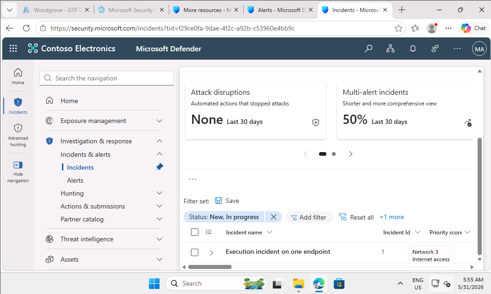

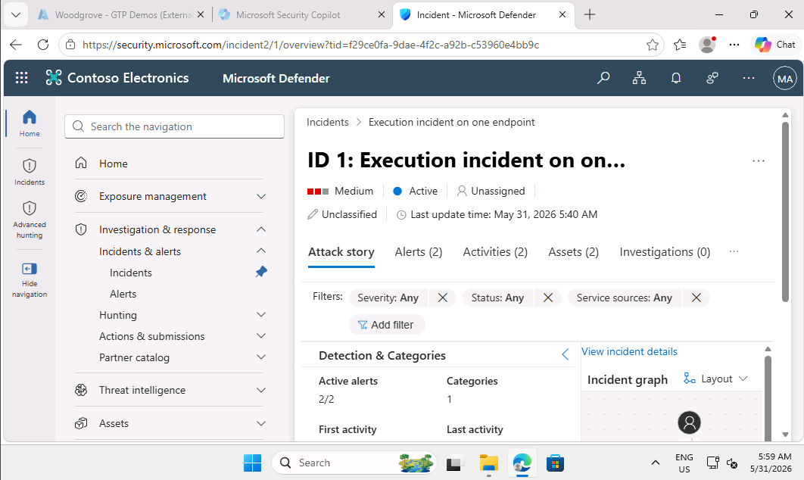

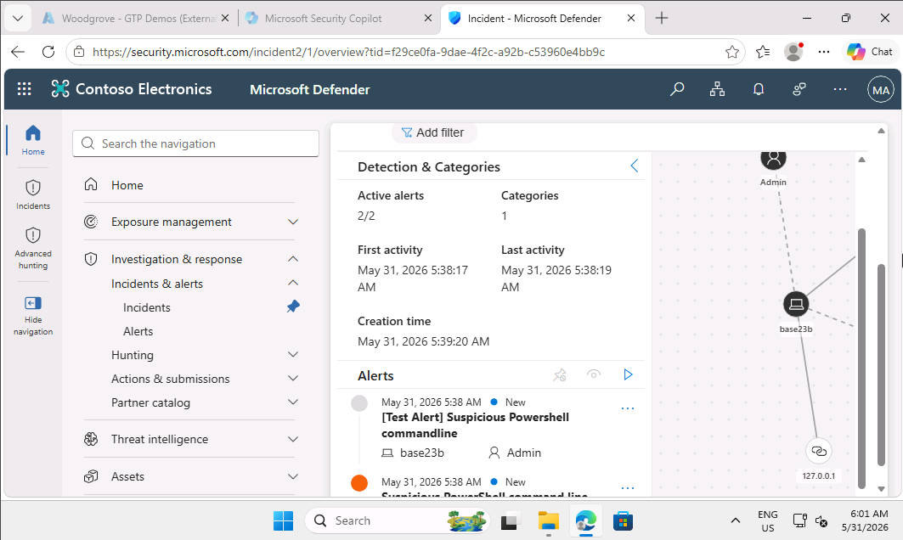

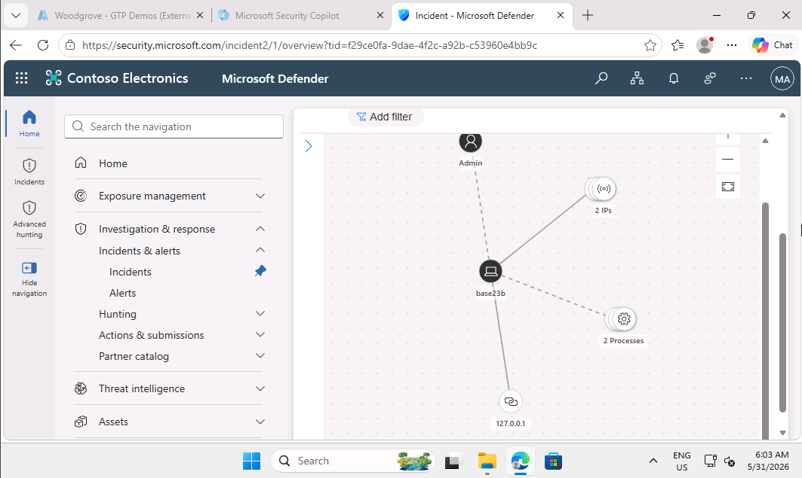

---

## 5. Incident Management

Managed and updated the incident as part of the investigation process.

### Activities Performed

- Accessed incident management options
- Assigned the incident to myself
- Updated investigation ownership and tracking
- Confirmed successful incident update

### Screenshots

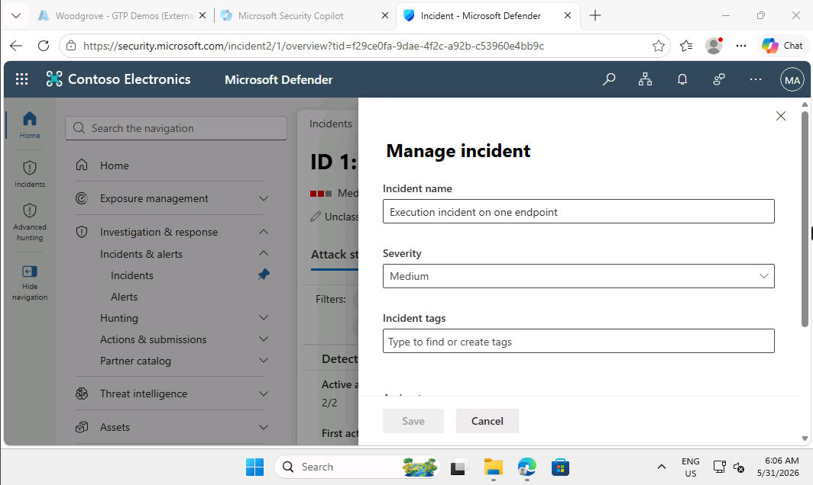

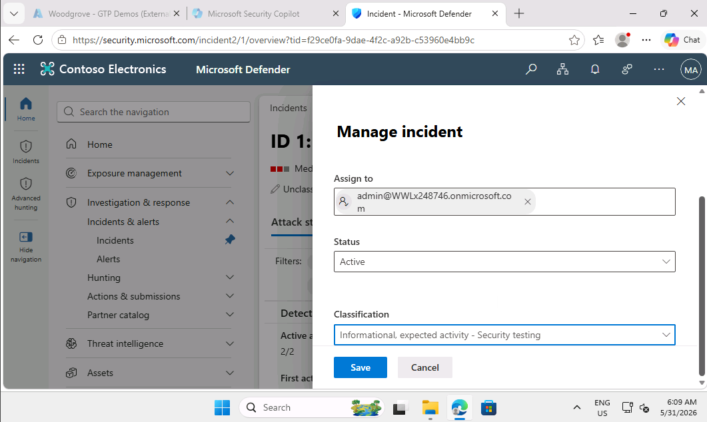

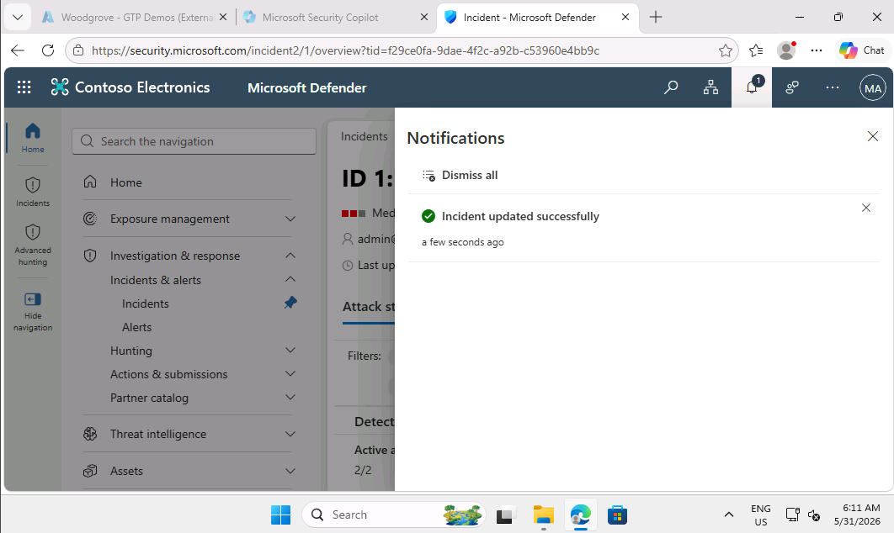

---

## 6. Attack Simulation & Investigation

Investigated a simulated multi-stage PowerShell attack to understand attack behavior and incident progression.

### Activities Performed

- Reviewed simulated attack activity
- Analyzed incident summary
- Investigated alerts and associated activities
- Reviewed indicators related to the incident

### Screenshots

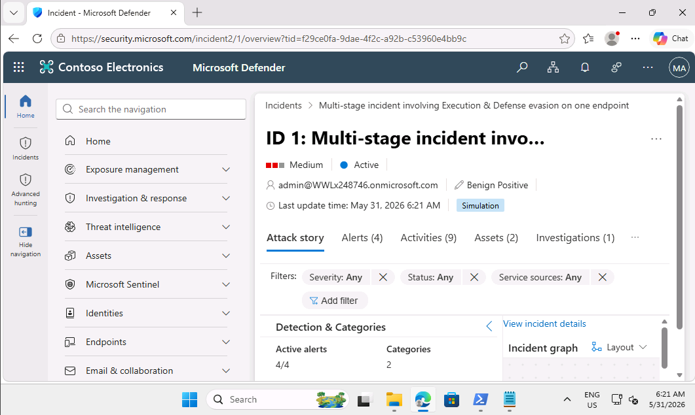

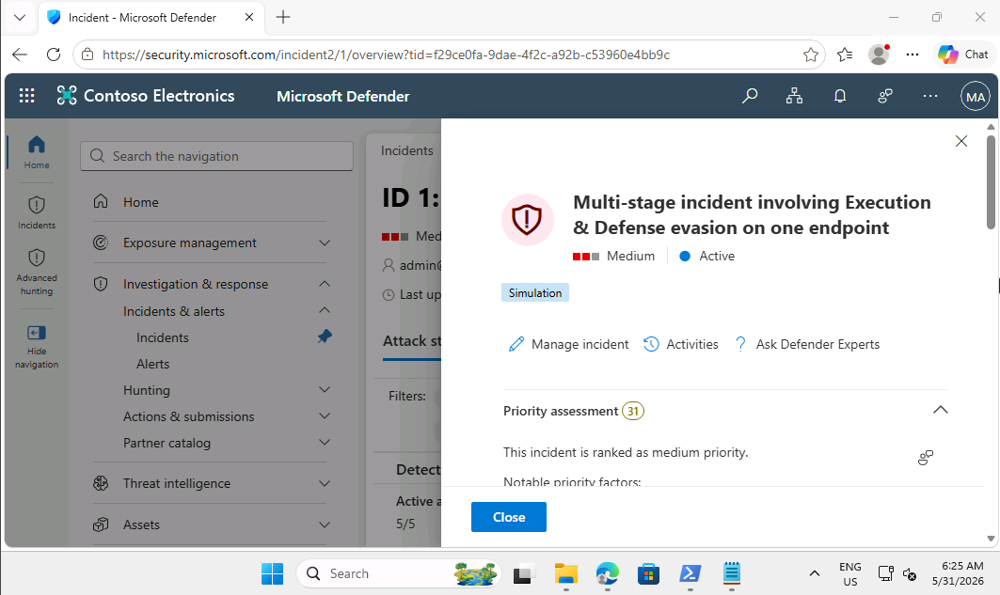

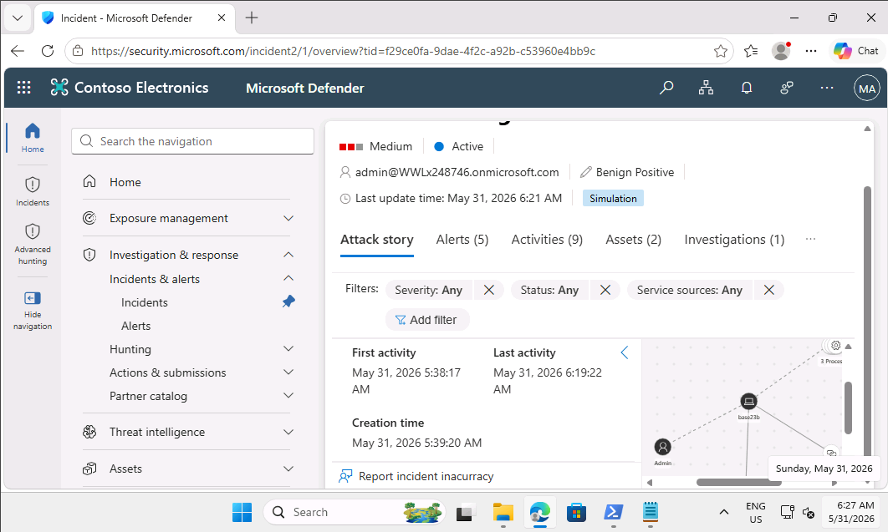

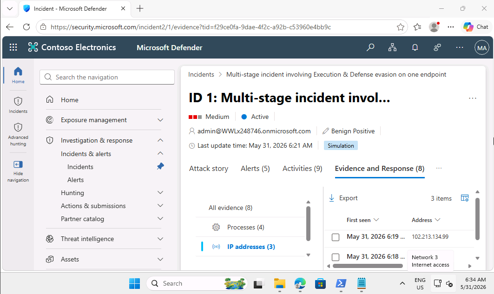

---

# Skills Demonstrated

- Microsoft Defender for Endpoint Administration
- Endpoint Detection & Response (EDR)
- Security Incident Investigation
- Threat Detection
- Incident Management
- PowerShell Attack Analysis
- Security Monitoring
- Alert Triage
- Root Cause Analysis
- SOC Operations

---

# Lessons Learned

This lab strengthened my understanding of:

- Endpoint security monitoring
- Microsoft Defender investigation workflows
- Alert analysis techniques
- Security incident management
- Threat detection processes
- Attack investigation methodologies
- Incident ownership and tracking
- Security operations procedures

---

# Future Improvements

Planned future enhancements include:

- Advanced Threat Hunting
- KQL-Based Investigations
- Automated Incident Response
- Threat Intelligence Integration
- MITRE ATT&CK Mapping
- Endpoint Isolation Procedures
- Security Automation Workflows
