# Microsoft Security Copilot Lab

## Overview

This lab demonstrates the configuration and deployment of Microsoft Security Copilot within a Microsoft Azure environment. The project focused on configuring Azure access management, assigning privileged roles, enabling Microsoft 365 integration, and preparing the Security Copilot environment for AI-assisted security operations.

The lab strengthened practical skills in:
- Microsoft Security Copilot
- Azure Access Management
- Microsoft Entra ID
- Identity & Access Management (IAM)
- Security Administration
- AI-Assisted Security Operations

---

# Technologies Used

- Microsoft Security Copilot
- Microsoft Azure
- Microsoft Entra ID
- Microsoft Purview
- Azure Access Control (IAM)
- Microsoft 365 Security Services

---

# Objectives

- Configure Azure resource management access
- Configure Microsoft Entra ID settings
- Assign privileged administrator roles
- Configure Microsoft Security Copilot
- Enable Microsoft 365 security integrations
- Configure audit logging and security roles
- Prepare the environment for AI-assisted investigations

---

# Lab Activities

## 1. Azure Resource Access Management

Configured Azure resource access management within Microsoft Entra ID.

### Activities Performed
- Navigated to Microsoft Entra ID
- Accessed the Properties section
- Enabled Azure Resources Management
- Saved the updated configuration

### Screenshots

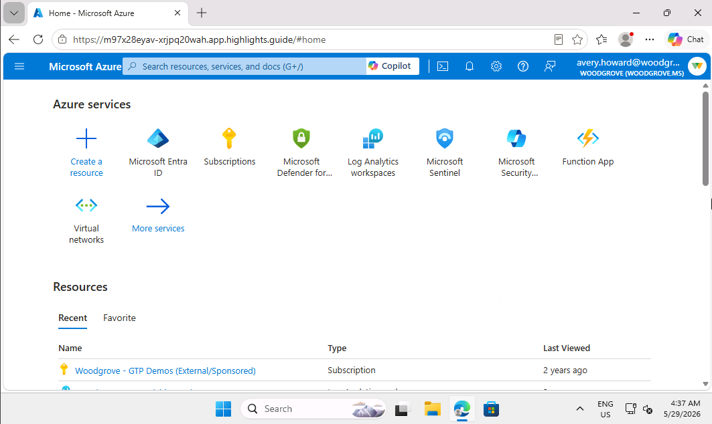

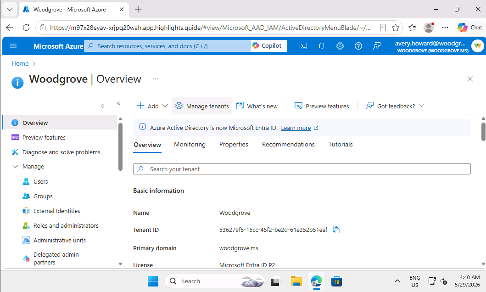

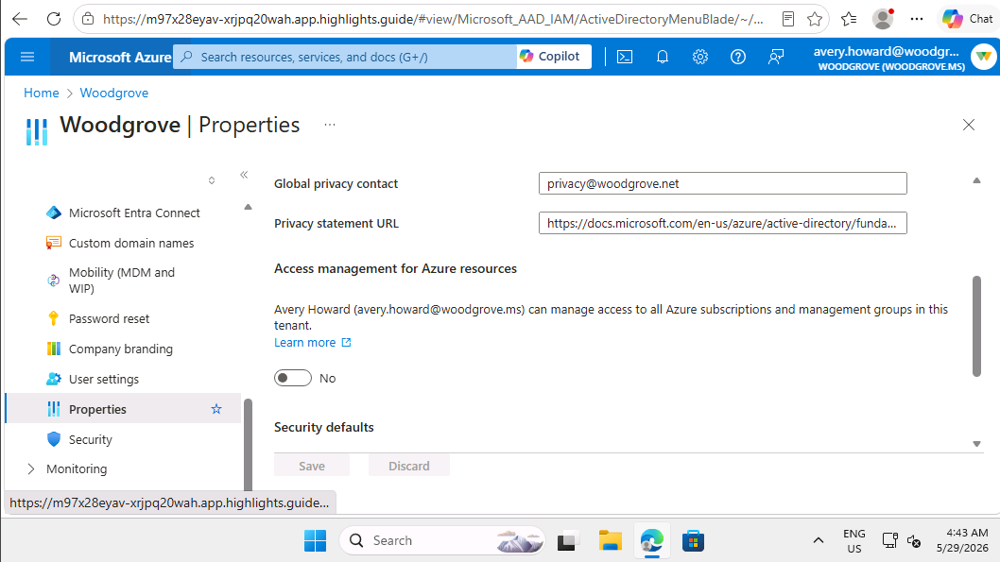

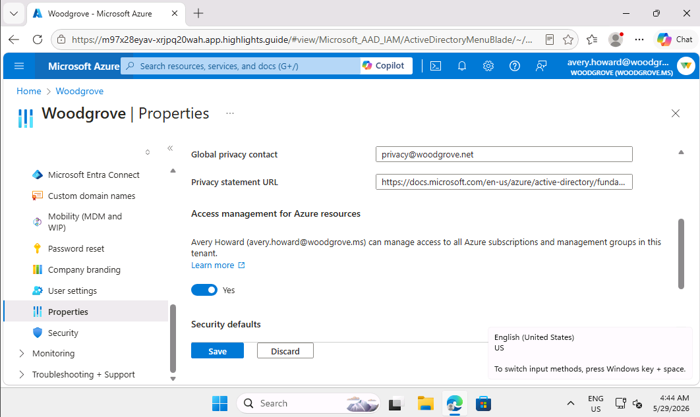

---

## 2. Subscription & Access Control Configuration

Configured Azure subscription access and Identity & Access Management (IAM) roles.

### Activities Performed
- Selected the Azure subscription
- Accessed Access Control (IAM)
- Configured privileged administrator roles
- Assigned the Owner role
- Added members and configured assignment conditions

### Screenshots

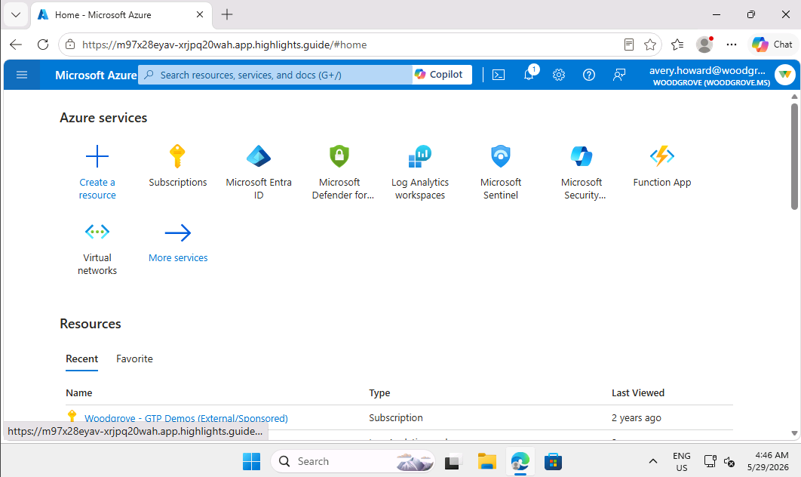

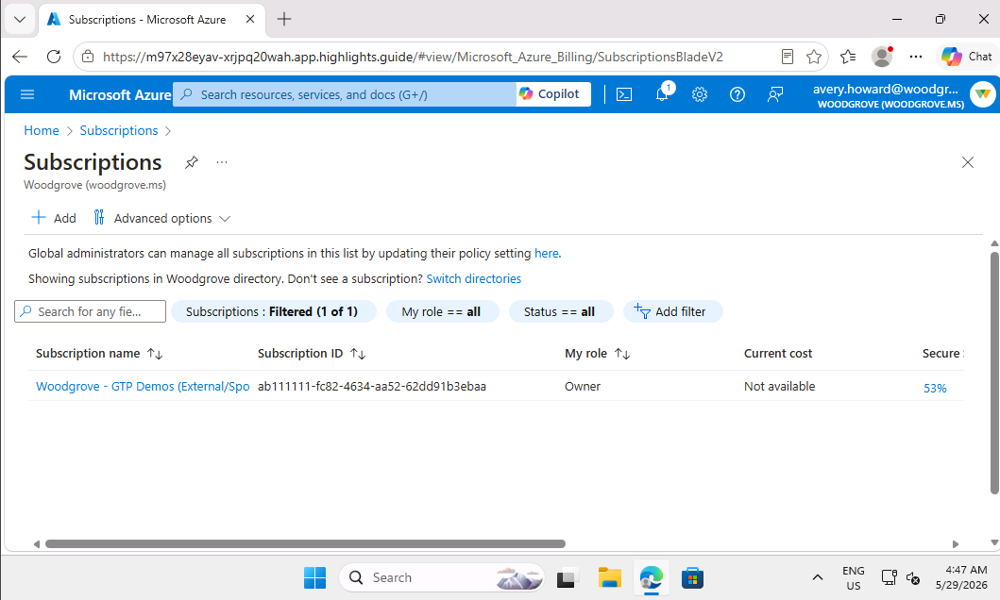

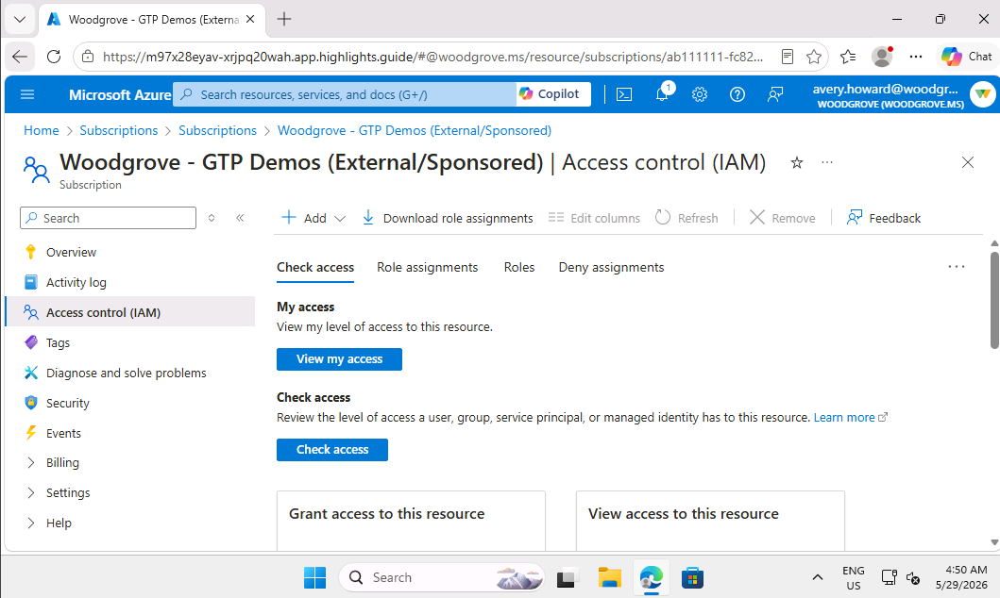

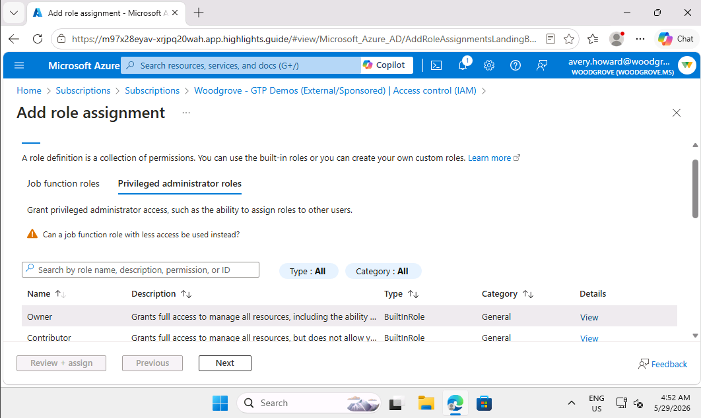

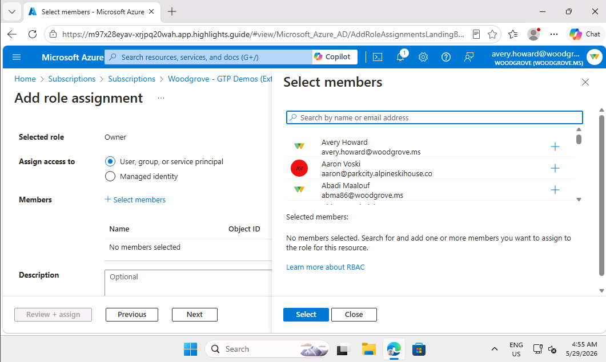

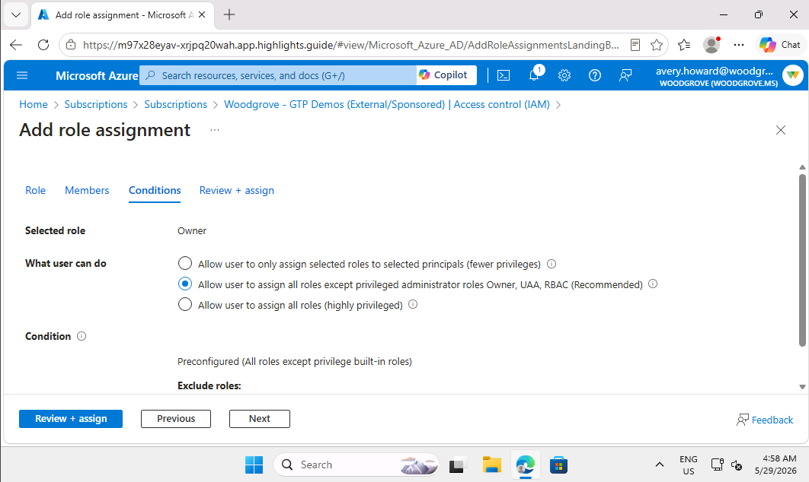

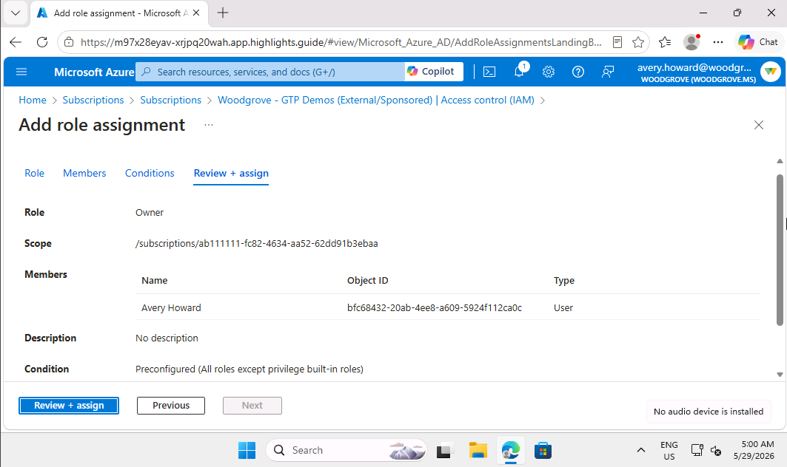

---

# Microsoft Security Copilot Configuration

Configured the Microsoft Security Copilot environment and security data integration settings.

### Activities Performed
- Configured security capacity
- Configured data storage settings
- Enabled Microsoft 365 service integration
- Enabled audit logging in Microsoft Purview
- Reviewed tenant security roles

### Screenshots

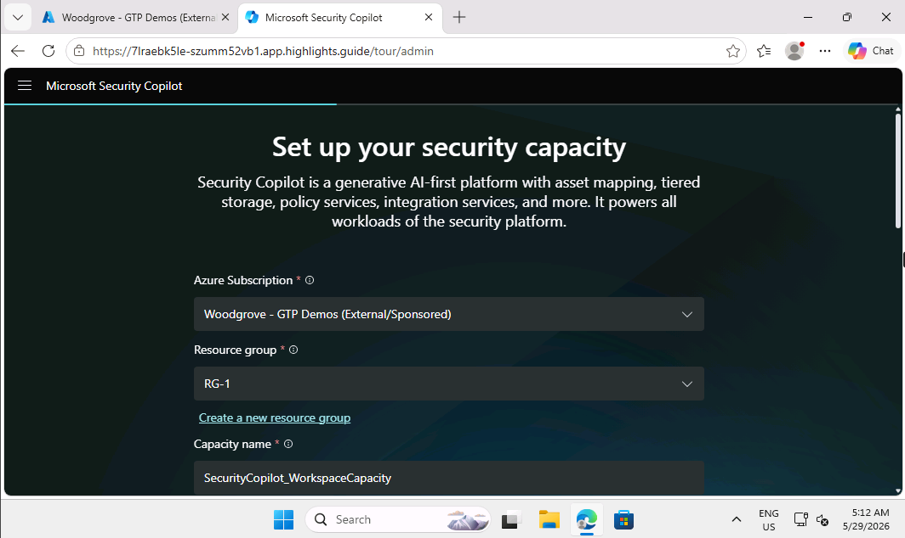

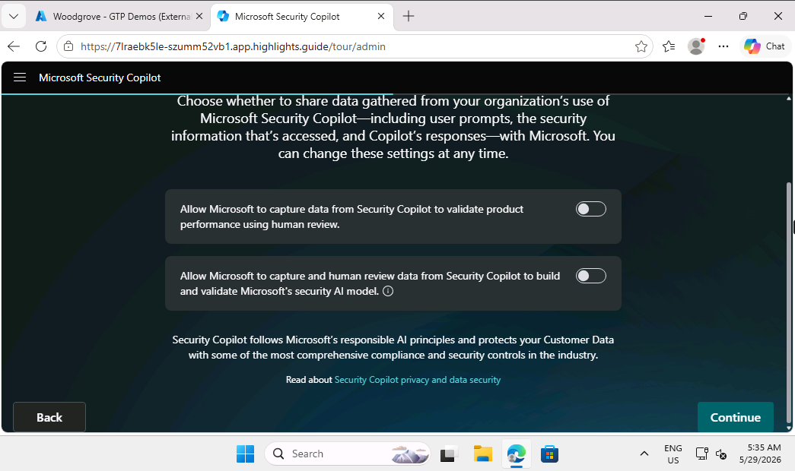

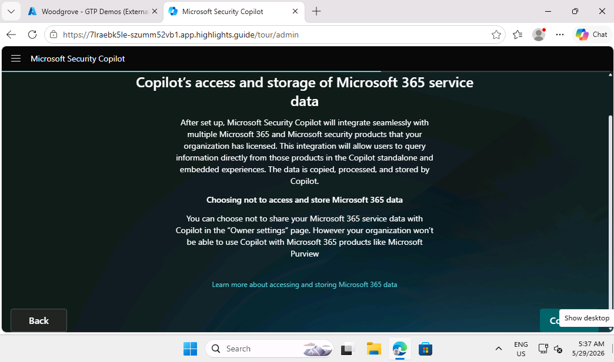

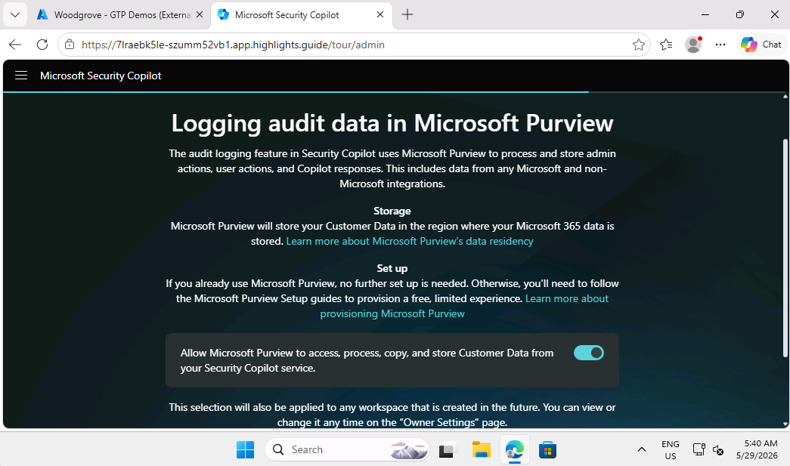

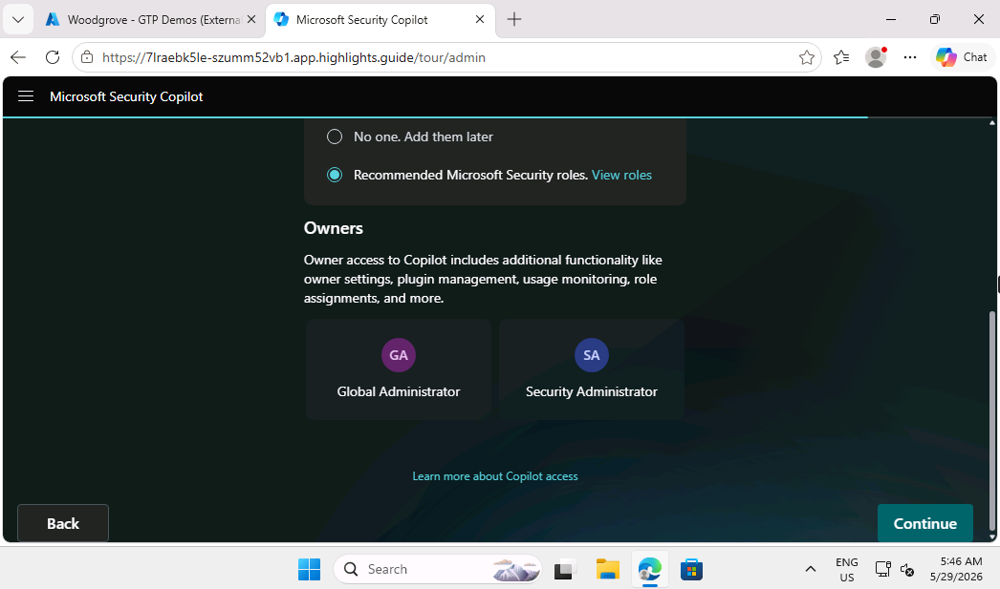

---

# Security Copilot Operational Readiness

Successfully configured Microsoft Security Copilot for:
- Incident investigation
- Suspicious script analysis
- Threat intelligence summarization
- AI-assisted security operations

### Screenshot

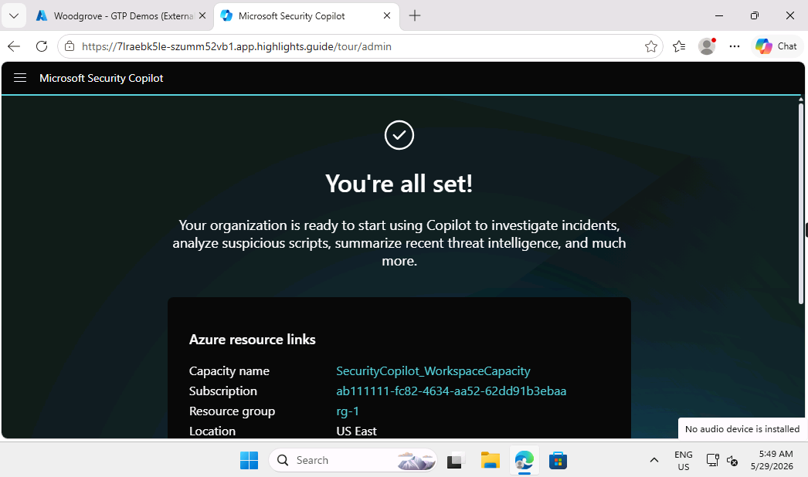

---

# Skills Demonstrated

- Microsoft Security Copilot Administration
- Microsoft Entra ID Configuration
- Azure IAM Configuration
- Role-Based Access Control (RBAC)
- Cloud Security Administration
- Identity & Access Management
- Microsoft 365 Security Integration
- Security Operations Support
- AI-Assisted Security Operations

---

# Lessons Learned

This lab strengthened my understanding of:
- Microsoft cloud security ecosystems
- Azure access management
- Security role administration
- Security Copilot configuration
- AI-assisted security workflows
- Microsoft 365 security integration
- Enterprise security administration

---

# Future Improvements

Planned future enhancements include:
- Threat Hunting with Security Copilot
- Security Incident Investigation
- Microsoft Sentinel Integration
- KQL-Based Threat Analysis
- Automated Security Workflows
- Advanced Security Monitoring
- AI-Assisted Threat Intelligence Analysis
